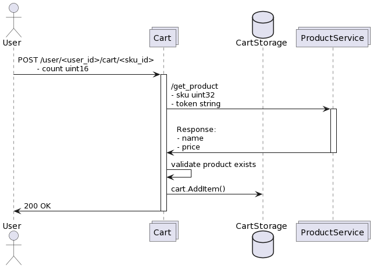

# cart - сервис корзины.

1. Используется HTTP, на основе стандартной библиотеки Go.
2. Для определения существования товара дела поход во внешний сервис (Product Service, который пока не реализован и работает как заглушка).
3. В качестве паттерна проектирования выбрана чистая архитектура (предполагает разделение приложения на независимые слои, каждый из которых выполняет конкретную функцию; слои взаимодействуют между собой через четко определенные интерфейсы).

   Слои: 
      - Слой внешних интерфейсов (user делает http-запрос через какой-то интерфейс - в данном случае curl или postman);
      - Слой контроллеров (обрабатывает http-запрос, валидирует входные данные, вызывает определенный метод сервисного слоя);
      - Слой сервисов (принимает данные со слоя контроллеров, осуществляет бизнес-логику, вызывает методы хранилищ);
      - Слой хранилищ (принимает данные со слоя сервиса, каким-то образом их обрабатывает).
4. ServiceProvider - это компонент, который используется для централизованного управления зависимостями и сервисами приложения. Для него используется паттерн Singleton.
5. Все ключевые данные лежат в config/config.yaml; они парсятся в структуру с помощью internal/cart/config.
6. В качестве отслеживания работы приложения используется собственноручно написанный logger (internal/cart/logger) на основе https://github.com/uber-go/zap.

## Взаимодействия:
1. Добавить товар в корзину.
    * Идентификатором товара является числовой идентификатор SKU. 
    * Метод добавляет указанный товар в корзину определенного пользователя. 
    * Каждый пользователь имеет числовой идентификатор userID. 
    * При добавлении в корзину проверяется, что товар существует в специальном сервисе. (не реализовано)
    * Один и тот же товар может быть добавлен в корзину несколько раз, при этом количество экземпляров складывается.

| Метод | URI                                             |
|-------|-------------------------------------------------|
| POST  | /user/<user_id>/cart/<sku_id>                   |

## Параметры запроса
| Параметр | Тип параметра | Тип данных | Пример | Описание                                                        |
|----------|---------------|------------|--------|-----------------------------------------------------------------|
| user_id  | query path    | int64      | 1007   | Идентификатор пользователя в корзину которого добавляется товар |
| sku_id   | query path    | int64      | 2008   | Идентификатор товара, добавляемого в корзину                    |
| count    | body          | uint16     | 12     | Количество товаров, добавляемое в корзину                       |

## Параметры ответа
Отсутствуют

## Диаграмма последовательности 

