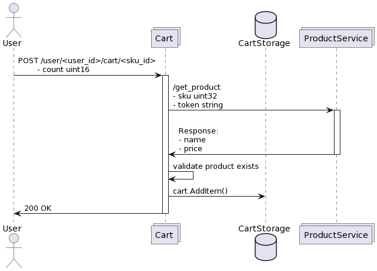
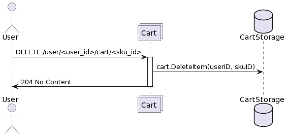

# cart - сервис корзины.

1. Используется HTTP, на основе стандартной библиотеки Go.
2. Для определения существования товара дела поход во внешний сервис (Product Service, который пока не реализован и работает как заглушка; не реализовано)

## Взаимодействия:
## 1. Добавить товар в корзину.
   * Идентификатором товара является числовой идентификатор SKU. 
   * Метод добавляет указанный товар в корзину определенного пользователя. 
   * Каждый пользователь имеет числовой идентификатор userID. 
   * При добавлении в корзину проверяется, что товар существует в специальном сервисе. (не реализовано)
   * Один и тот же товар может быть добавлен в корзину несколько раз, при этом количество экземпляров складывается.

| Метод | URI                                             |
|-------|-------------------------------------------------|
| POST  | /user/<user_id>/cart/<sku_id>                   |

### Параметры запроса
| Параметр | Тип параметра | Тип данных | Пример | Описание                                                        |
|----------|---------------|------------|--------|-----------------------------------------------------------------|
| user_id  | query path    | int64      | 1007   | Идентификатор пользователя в корзину которого добавляется товар |
| sku_id   | query path    | int64      | 2008   | Идентификатор товара, добавляемого в корзину                    |
| count    | body          | uint16     | 12     | Количество товаров, добавляемое в корзину                       |

### Параметры ответа
Отсутствуют

### Диаграмма последовательности 

## 2. Удалить товар из корзины
   * Метод полностью удаляет все количество товара из корзины пользователя. Если у пользователя вовсе нет данной позиции,
то возвращается такой же ответ, как будто бы все позиции данного sku были успешно удалены

| Метод  | URI                                             |
|--------|-------------------------------------------------|
| DELETE | /user/<user_id>/cart/<sku_id>                   |

### Параметры запроса
| Параметр | Тип параметра | Тип данных | Пример | Описание                                                        |
|----------|---------------|------------|--------|-----------------------------------------------------------------|
| user_id  | query path    | int64      | 1007   | Идентификатор пользователя в корзину которого добавляется товар |
| sku_id   | query path    | int64      | 2008   | Идентификатор товара, удаляемого из корзины                     |

### Параметры ответа
Отсутствуют

### Диаграмма последовательности:

